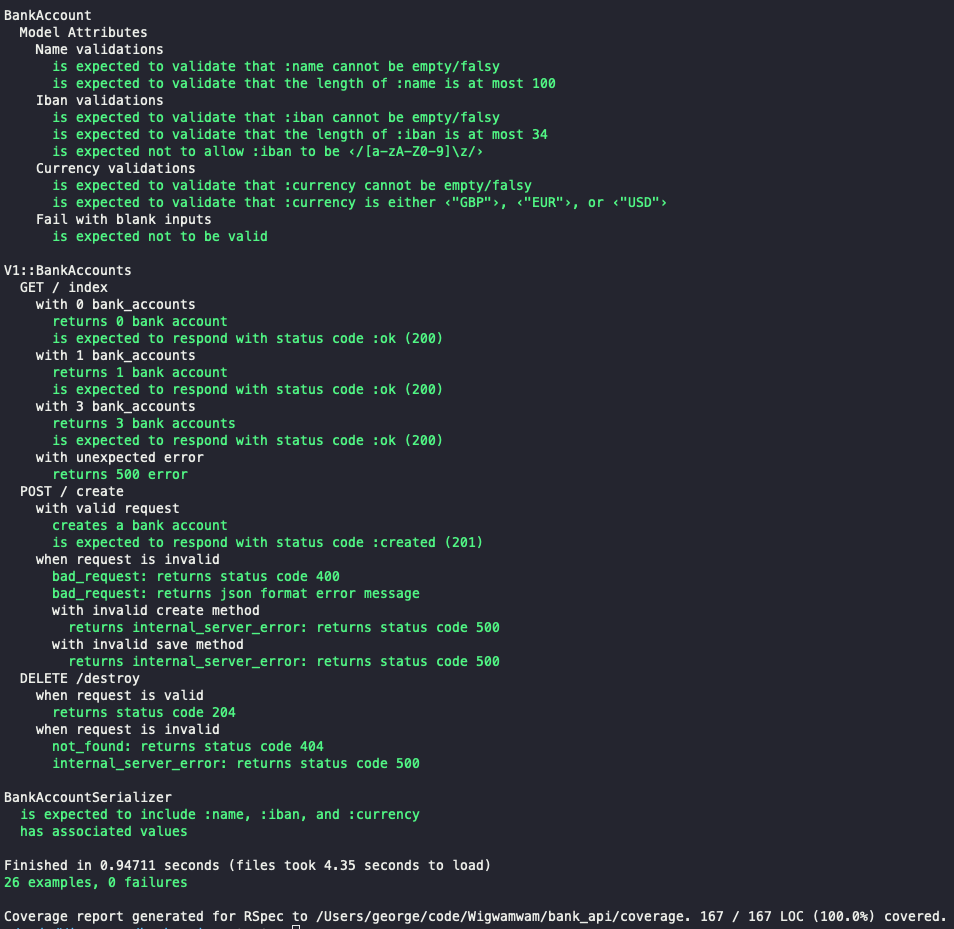

## Description

The follow repo was built to enhance my skills in TDD and building APIs. It contains one model, bank_account. The bank account model has the following attributes:

* id: unique id of the bank account (no requirements on type or length)
* name: name of the bank account (free text, up to 100 characters)
* iban: accounts iban (up to 34 characters, only letters and numbers)
* currency: accounts' currency (the only supported currencies are GBP, EUR and USD)

The aim of the excerise was to generate API end-points that enables the end user to create, index and delete bank accounts. Learnings included:

1. TDD /BDD for APIs
2. API serialisation
3. Edge case errors and tests
4. Postman

## Requirements

This repo currently works with:

* Rails 7.0.4
* Ruby 3.1.2
* Bundler 2.2.32
* Database: PostgreSQL (*)

(*) Rationale: When scaling, Postgres offers a wider variety of data types compared with MySQL. PostgresSQL has less limitations in the eventiality of building out a bank system. Compared with MySQL, Postgres, can handle unique data types, unstructured data, complex queries and frequent write operations making it a good choice for enterprise level scope.

## Set-Up

- Pull the project from this public repository using clone repo `gh repo clone Wigwamwam/bank_api`
- Run `bundle install` in your terminal to install the necessary gems and dependencies.
- Run `rails db:create db:migrate` in your terminal to set up the database.
- Run `rails db:seed` in your terminal to seed the database with 10 instances of bank_account.

## Testing

The repo followed a TDD / BDD approach. Rspec was used for running unit tests. Rspec was chosen over minitest becauses it focuses on readable specifications describing how the application is supposed to behave with a close match to English. To run the tests, ensure you have followed the instructions in 'Set-Up', then run the following:

`bundle exec rspec`
or
`rspec`
<!-- insert pic of tests passing -->



We used the `gem simplecov` in order to ensure test coverage was 100%. To run simplecov, conduct the following after running rspec:
`open coverage/index.html`

<!-- insert test coverage picture -->

## Usage
<!-- Outline postman usage and outcome -->
Rails routes included the following:
<!-- insert photos of rails routes -->

## API Specs:
### Create

This call creates a new bank account in your service.

__Method__: `POST`

__URI__: `/v1/bank_accounts`

__Payload__:

```json
{
    "name": "Test Bank Account",
    "iban": "RO66BACX0000001234567890",
    "currency": "USD"
}
```

__Response__:

* Success: status code `201`, payload:

```json
{
    "id": 1, // unique id generated by service, can be any type you decide
    "name": "Test Bank Account",
    "iban": "RO66BACX0000001234567890",
    "currency": "USD"
}
```

* Invalid request: status code `400`, payload:

```json
{
    "errors": [
        {
            "field": "iban",
            "error": "invalid length",
        },
        ...
    ]
}
```

* Unexpected error: status code `500`, no payload


### GET

This call returns all bank accounts stored by the service

__Method__: `GET`

__URI__: `/v1/bank_accounts`

__Payload__: no payload

__Response__:

* Success: status code `200`, payload:

```json
[
    {
        "id": 1, // unique id generated by service, can be any type you decide
        "name": "Test Bank Account",
        "iban": "RO66BACX0000001234567890",
        "currency": "USD"
    },
    {
        "id": 2, // unique id generated by service, can be any type you decide
        "name": "Another Bank Account",
        "iban": "PT50002700000001234567833",
        "currency": "EUR"
    },
]
```

* Unexpected error: status code `500`, no payload


### DELETE

This call deletes a bank account stored by the service. The bank account id will be found in the URI.

__Method__: `DELETE`

__URI__: `/v1/bank_accounts/<id>`

__Payload__: no payload

__Response__:

* Success: status code `204`, no payload

* Bank account with give id does not exist: status code `404`, no payload

* Unexpected error: status code `500`, no payload


#### Additional Gems and justification

* Core
    * [active_type][] – for building simple and effective form/service objects
    * [sidekiq][] – Redis-based job queue implementation for Active Job
* Configuration
    * [dotenv][] – for local configuration
* Style
    * [Pico.css][pico] - a great-looking default stylesheet
* Utilities
    * [annotate][] – auto-generates schema documentation
    * [amazing_print][] – try `ap` instead of `puts`
    * [good_migrations][] - prevents app models from being improperly referenced in migrations
    * [rubocop][] – enforces Ruby code style
    * [erblint][] – applies rubocop rules within html.erb files
    * [syntax_suggest][] – easier troubleshooting of Ruby syntax errors
* Security
    * [brakeman][] and [bundler-audit][] – detect security vulnerabilities
* Testing
    * [capybara-lockstep][] – for more reliable browser testing
    * [shoulda][] – shortcuts for common ActiveRecord tests


#### Other tweaks that patch over some Rails shortcomings

## How does it work?


## Improvements


## Out of scope

There are a few things that are out of scope for this exercise but the technologies I would have used to conduct the followering were:
<!-- implement rationale -->

* Authentication
* Any type of monitoring
* Database migrations
* Continuous Integration (CI) / Continuous Delivery (CD)
* Deployment or hosting
