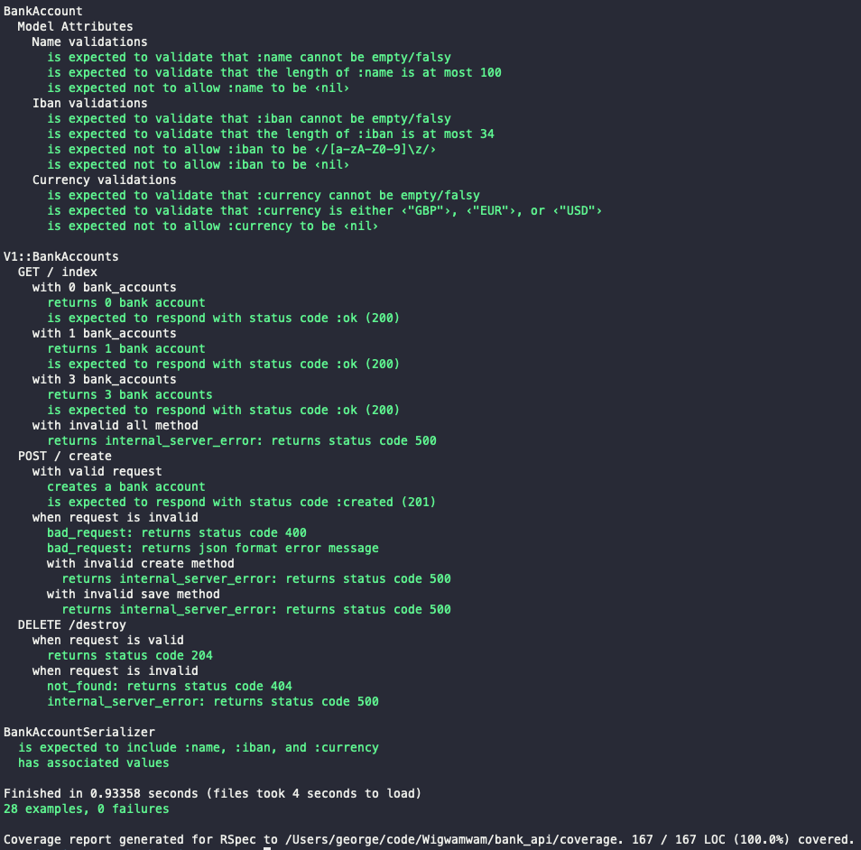
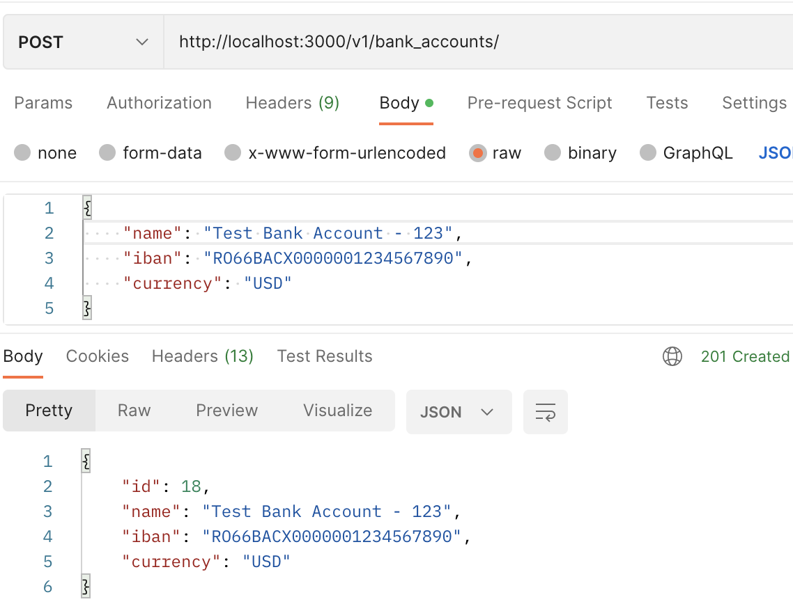
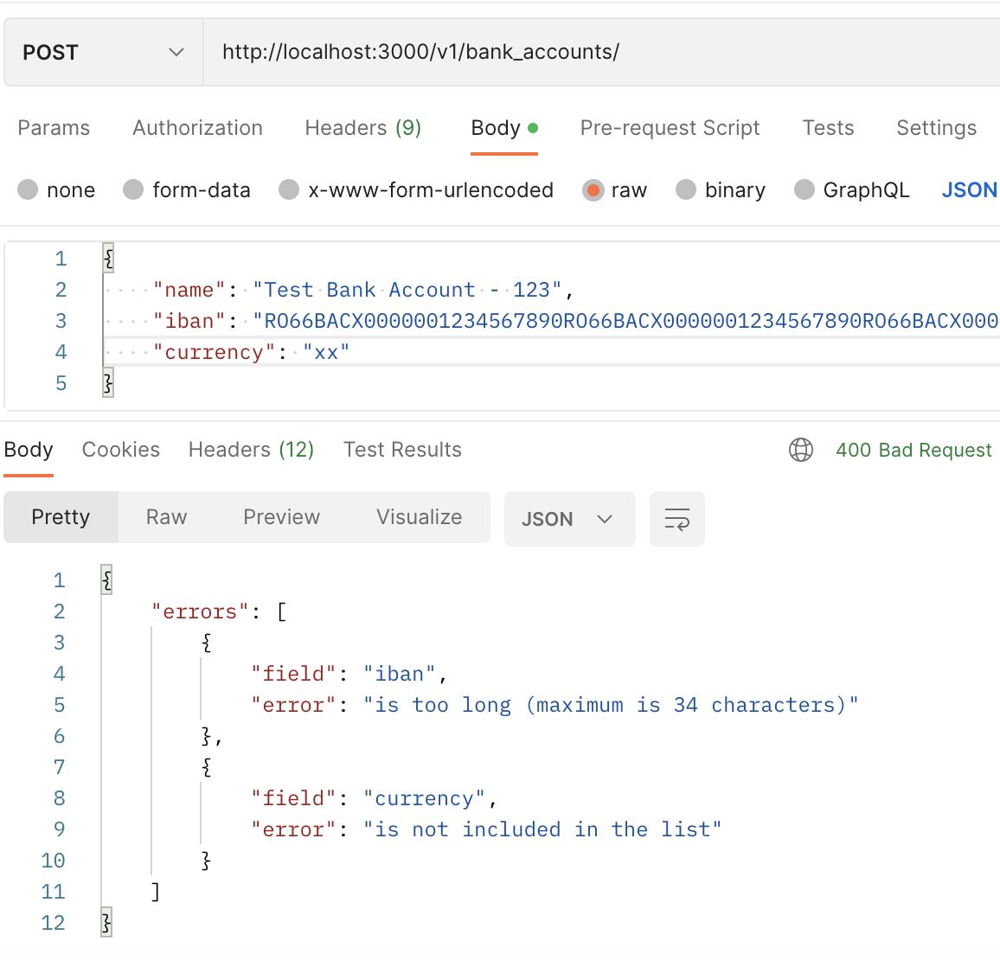
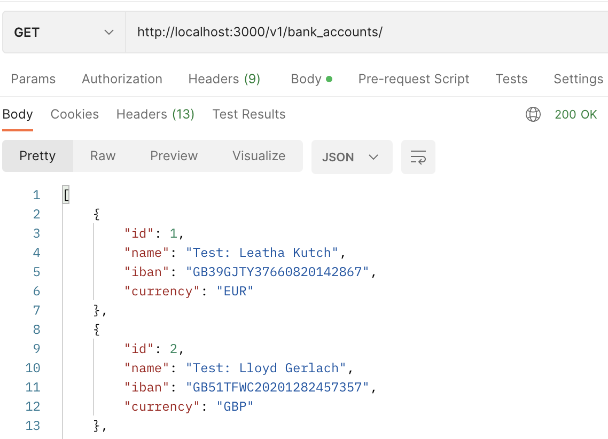
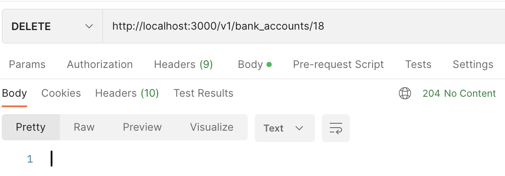

## Description

This Rails' repo contains one model: bank_account. The bank account model has the following attributes:

* id: unique id of the bank account (no requirements on type or length)
* name: name of the bank account (free text, up to 100 characters)
* iban: accounts iban (up to 34 characters, only letters and numbers)
* currency: accounts' currency (the only supported currencies are GBP, EUR and USD)

The excerise aimed to enable an end user to call the api with the post / get / destroy methods. Learnings included:

1. TDD /BDD for APIs
2. API serialisation
3. Edge case errors and tests
4. Postman

## Navigation

* [Requirements](#requirements)
* [Set-Up](#set-up)
* [Testing](#testing)
* [Run Service on Local Development](#run-service-on-local-development)
* [API Specs](#api-specs)
* [Improvements](#improvements)
* [Postman Responses](#postman-responses)

## Requirements

This repo currently works with:

* Rails 7.0.4
* Ruby 3.1.2
* Bundler 2.2.32
* Database: PostgreSQL (*)

(*) Rationale: When scaling, Postgres offers a wider variety of data types than MySQL. PostgresSQL has less limitations in the eventuality of building out a bank system. Compared with MySQL, Postgres can handle unique data types, unstructured data, complex queries and frequent write operations, making it a good choice for enterprise level scope.

## Set-Up

- Pull the project from this public repository using clone repo `gh repo clone Wigwamwam/bank_api`
- Run `bundle install` in your terminal to install the necessary gems and dependencies.
- Run `rails db:create db:migrate` in your terminal to set up the database.
- Run `rails db:seed` in your terminal to seed the database with 10 instances of bank_account.

## Testing

The repo followed a TDD / BDD approach. Rspec was used for running unit tests. Rspec was chosen over minitest because it focuses on readable specifications describing how the application is supposed to behave with a close match to English. To run the tests, ensure you have followed the instructions in 'Set-Up', then run the following:

`bundle exec rspec`
or
`rspec`




We used the `gem simplecov` in order to ensure test coverage was 100%. To run simplecov, conduct the following after running rspec:
`open coverage/index.html`

## Run Service on Local Development

To run the service on local development, ensure you have followed 'Set-Up' and 'Testing' sections. To start local development run `rails s` in the terminal.
To call the API service, go to Postman [https://www.postman.com/] and sign up. Then, follow these instructions [https://learning.postman.com/docs/getting-started/sending-the-first-request/] with the following route paths to access the service:

```
GET         http://localhost:3000/v1/bank_accounts
POST        http://localhost:3000/v1/bank_accounts
DELETE      http://localhost:3000/v1/bank_accounts/:id
```
(n.b) - check what number your local host is listening on i.e (3000)

## API Specs:

The following outlines the API spec for get / post / destroy methods. Please see 'Postman Response' section for examples of calling the api and the responses.

### Create

This call creates a new bank account in your service.

__Method__: `POST`

__URI__: `/v1/bank_accounts`

__Payload__:

```json
{
    "name": "Test Bank Account",
    "iban": "RO66BACX0000001234567890",
    "currency": "USD"
}
```

__Response__:

* Success: status code `201`, payload:

```json
{
    "id": 1,
    "name": "Test Bank Account",
    "iban": "RO66BACX0000001234567890",
    "currency": "USD"
}
```

* Invalid request: status code `400`, payload:

```json
{
    "errors": [
        {
            "field": "iban",
            "error": "invalid length",
        },
        ...
    ]
}
```

* Unexpected error: status code `500`, no payload


### GET

This call returns all bank accounts stored by the service

__Method__: `GET`

__URI__: `/v1/bank_accounts`

__Payload__: no payload

__Response__:

* Success: status code `200`, payload:

```json
[
    {
        "id": 1, // unique id generated by service, can be any type you decide
        "name": "Test Bank Account",
        "iban": "RO66BACX0000001234567890",
        "currency": "USD"
    },
    {
        "id": 2, // unique id generated by service, can be any type you decide
        "name": "Another Bank Account",
        "iban": "PT50002700000001234567833",
        "currency": "EUR"
    },
]
```

* Unexpected error: status code `500`, no payload


### DELETE

This call deletes a bank account stored by the service. The bank account id will be found in the URI.

__Method__: `DELETE`

__URI__: `/v1/bank_accounts/<id>`

__Payload__: no payload

__Response__:

* Success: status code `204`, no payload

* Bank account with give id does not exist: status code `404`, no payload

* Unexpected error: status code `500`, no payload

## Improvements

Here are several aspects to like to learn more about and add to this repo:

* Added authentication with devise
* Set up continuous intergration on Github
* Deployed onto AWS
* Added a type of monitoring with Datadog


## Postman Responses

Examples:

### Post - 201



### Post - 400



### Get - 200



### Destroy - 204


